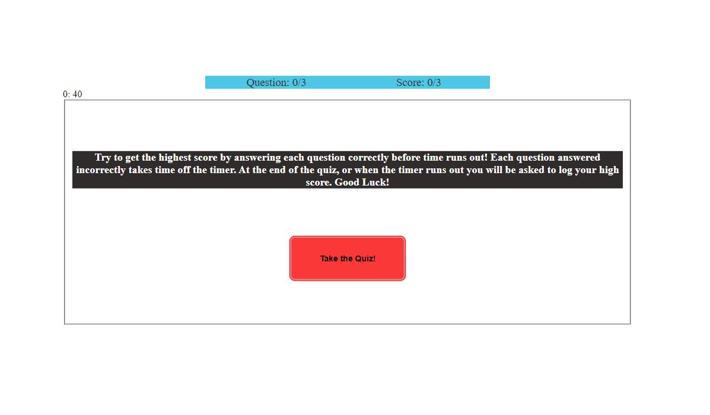
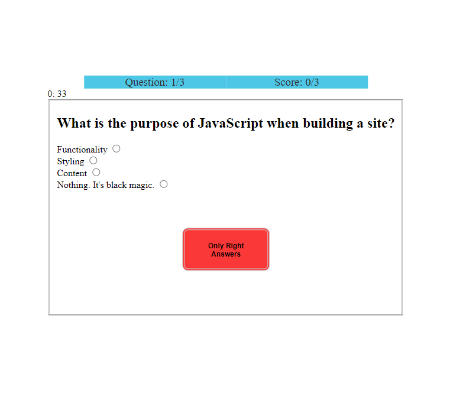
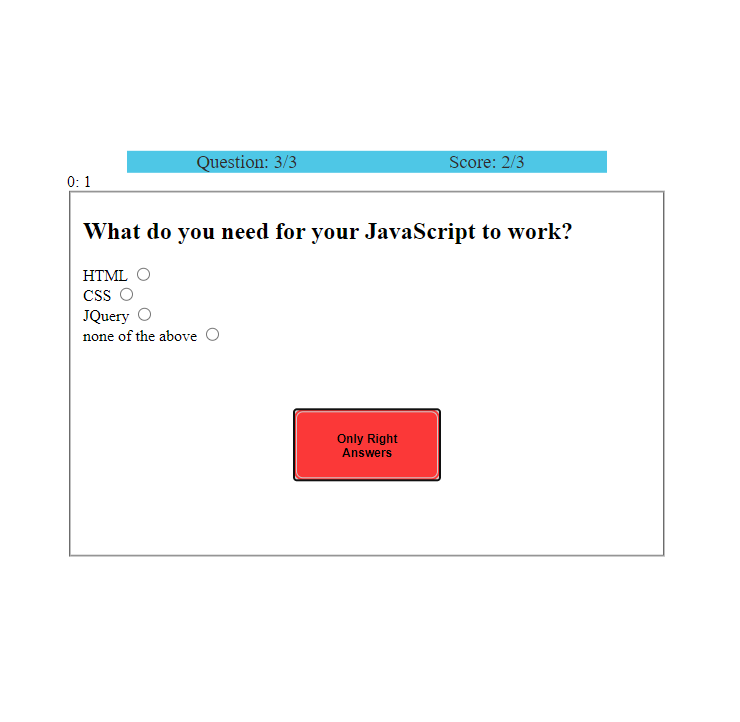
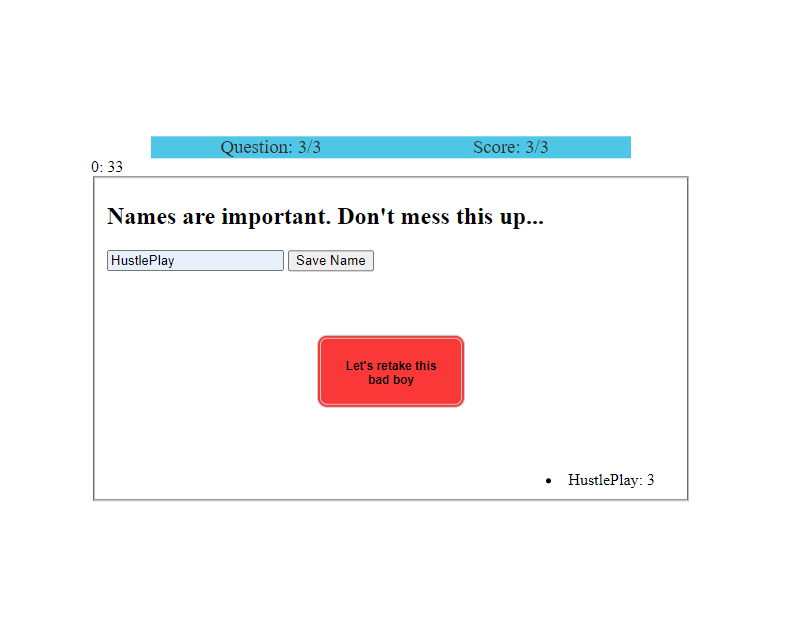

## JSQuiz

- This is a quiz application ran in the browser. The quiz was developed to minimally test the users knowledge of JavaScript.

## Installation
- Nothing is required of the User

## Usage
- The user should land on a page to start the quiz (HTML)
- The user should be presented with a button to start the quiz (HTML)
- When the user clicks the start button... (JS)
    - The intro form hides (JS)
    - The quiz form shows (JS)
    - The timer starts counting down (JS)
    - The first question renders (JS)
    - The first answer set renders (JS)
- For each question, the user should be able to click only one possible answer (JS)
- The user should be presented with a button to check if selected answer is correct (HTML)
- When the user clicks the button, their selection is checked (JS)
    - If the answer is correct, they earn a point (JS)
    - If the answer is incorrect, time is removed from the timer (JS)
- The user should progress to the next question (JS)
    - If it's the last question, the user should go to the high score page (JS)
- The user may enter their prefered name and submit their high score (JS)
    - The users input will be stored in an array and appended to the page, manipulating the DOM (JS)
- The user then has the option to retake the quiz (JS)
    - The user may click on the retake quiz button, and will be taken to the quiz intro form (JS)

## License
- MIT License

## Screenshots
- Quiz Intro

- Quiz Start

- Quiz Progression

- Quiz High Score

## Links
https://github.com/NathanForgille/JSQuiz/
https://nathanforgille.github.io/JSQuiz/

## Libraries
- None Used

## Credit
- Contributor
    - Zack Zboncak, https://github.com/zzboncak

## Authors
- Nathan Forgille